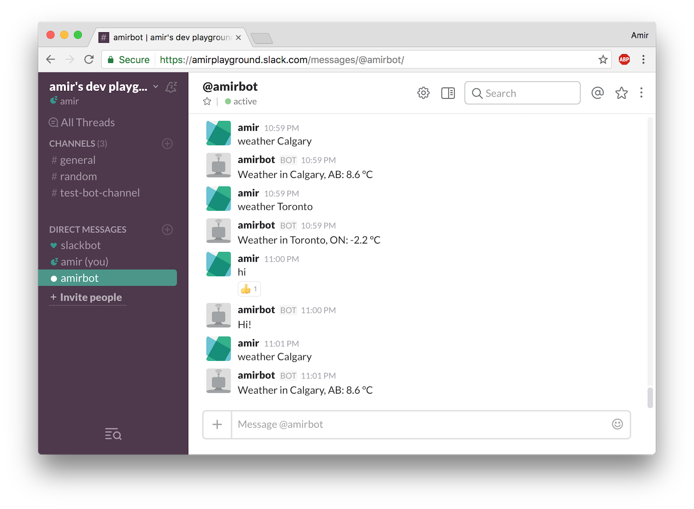

Steps to setup:

Slack Registration:
1. Regsiter for an account: https://api.slack.com/
2. Create an app
3. Register a bot user: https://api.slack.com/bot-users
4. https://${slack-team}.slack.com/apps/manage/custom-integrations
5. Update [slackbot_settings.py](slackbot_settings.py) with appropriate API_TOKEN
 
Development Setup:
1. Python 3.6.0
2. pip install -r requirements.txt
3. python run.py
4. tests found in [tests](tests)

Private message commands:
1. hi!
2. weather ${city}

Credits:
- https://github.com/lins05/slackbot
- https://github.com/gpailler/AtlassianBot
- https://github.com/igable/data-gc-ca-api
